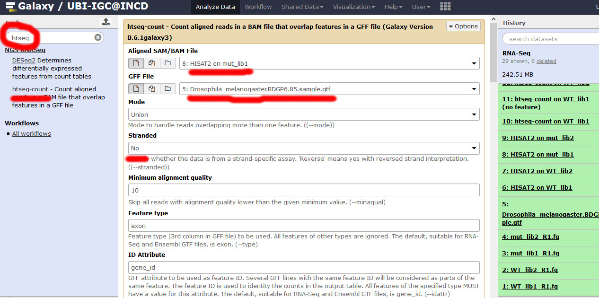

# Summer School 2018

## High Throughput Sequencing (HTS) Data Analysis

### Practical prelude

**TASK**: Go to [http://cloud118.ncg.ingrid.pt](http://cloud118.ncg.ingrid.pt). To login use as *username* and *password* 'randomX', where X is the group number that was attributed to you (1,2,3....). 

For this session, we're going to use [Galaxy](https://galaxyproject.org/). This is a popular tool that allows even non-expert users to execute many different bioinformatics programs, particularly High Throughput Sequencing data analysis, through a simple web interface. Most software for the analysis of HTS data is freely available to users. Nonetheless, they often require the use of the command line in a Unix-like environment. User-friendly desktop software such as [CLC](https://www.qiagenbioinformatics.com/products/clc-genomics-workbench/) or [Ugene](http://ugene.net/) is available, but given the quick pace of developmpent in this area, they are constantly outdated. Moreover, even with better algorithms, HTS analysis must often be run in external servers due to intense computational requirements. Galaxy hides all the computational infrastructure from the end user, making it easier for researchers with limited training in informatics.

**NOTE**: We're using a Galaxy instance specific for this session that is hosted in the [Portuguese Research Cloud (INCD)](http://www.incd.pt/) that will not be available after the course. Instances can be created according to research needs. There are also generic Galaxy instances publicly available such as [https://usegalaxy.eu/](https://usegalaxy.eu/). 

### Introduction

[Sanger sequencing](https://en.wikipedia.org/wiki/Sanger_sequencing) brought about a technological revolution, as it allowed to directly read DNA molecules with relative ease and affordability. The [Human Genome Project](https://en.wikipedia.org/wiki/Human_Genome_Project) motivated further progress, leading to automated DNA-sequencing machines capable of sequencing up to 384 samples in a single batch using capillary electrophoresis. 

At the moment, the high throughput sequencing technology most often used (by far) is Illumina. Similarly to the Sanger method, it is also based on the addition of nucleotides specifically modified to block DNA strand elongation, where each nucleotide is marked with a different color. Unlike the Sanger method, where a single DNA molecule is "read" at a time, modern illumina machines allow reading up to millions of DNA molecules simultaneously.  

The following links are a good source of information regarding this sequencing technology:
* [Illumina Sequencing by Synthesis](https://www.youtube.com/watch?&v=fCd6B5HRaZ8).
* [Elaine Mardis talk on NGS](https://www.youtube.com/watch?v=v1DbcJD4Ry0).

### The FastQ file format

Results of sanger sequencing are usually [fasta files](https://en.wikipedia.org/wiki/FASTA_format) (obtained from processing chromatograms). Most high-throughput sequencing machines output [fastq files](https://en.wikipedia.org/wiki/FASTQ_format), the “de facto” current standard in HTS. Like fasta, fastq files are simply text files, but where each block of information (a sequenced DNA fragment, or read) in this format is encoded as 4 lines:

	@read_identifier
	read_sequence
	+ separator line
	base_qualities
	
For example, here you have 8 lines of a fastq file, corresponding to 2 sequences:

	@HWI-M01876:76:000000000-AF16W:1:1101:10853:1000 1:N:0:CGTGACAGAT
	NTGTACTTCATCCGAAACTCGTGCTCATCTCTGCTCAGATCGGAAGAGCACACGTCTGAACTCCAGTCACCGTGAT
	+
	#8ABCFGGGFCEDCFGGGGGGGFFCGEFGGGGGGFGGGGGGGGDEFGGGGGGGGGGGGGGGGGFFFEGGGGGGGGF
	@HWI-M01876:76:000000000-AF16W:1:1101:16471:1000 1:N:0:CGTGAACTTG
	NTTCCAGATATTCGATGCATGTGCCGCTCCTGTCGGAGATCGGAAGAGCACACGTCTGAACTCCAGTCACCGTGAT
	+
	#8BCCGGGGGGGGGGGGGGGGGGGGGGGGGGGGGGGGGGGGGGGEGGGGFGGGGGGGGGGGGGGGGGGGGGGGGGG

Each base has a quality character associated with it, representing how confidently the machine identified (called) the base. The probability of error per base is given as a [Phred score](https://en.wikipedia.org/wiki/Phred_quality_score), calculated from an integer value (Q) derived from the quality character associated to the base. The probability of error is given by the Phred score using P(Q)=10^(-Q/10). Useful reference values of Q include:
* Q=10 - 90% accuracy (0.1 error)
* Q=20 - 99% accuracy (0.01 error)
* Q=30 - 99.9% accuracy (0.001 error)
* Q=40 - 99.99% accuracy (0.0001 error)

Although there's theoretically no limit, Q usually goes up to around 40 in recent illumina machines.

**TASK**: Inspect the contents of mut_lib1_R1.fq. 

**Question**: What is the sequence of the first read in mut_lib1_R1.fq? And where is the information regarding the qualities of the bases?

Click Here to see the answer

The sequence of the first read is in the 2nd line:  "TTGCTGCTCTGGTTGTCGACAACGGCTCTGGCATGTGCAAGGCCGGATTTGCCGGAGACGATGCTCCCCGCGCCGTCTTCCCATCGATTGTGGGACGTC". The information on its base qualities is in the 4th line: "CCCFFFFFHHGHHIJIIJIIJJJGIHEHJJJHIIJGJJJJIJIJIJEHIHHHHHFCDBBDDDDDDDDDDDBB@BDBDDBDCDDDDB?BDBDDBBBBDDB".

### RNA-Seq

In RNA-Seq experiments, we're sequencing the transcripts that are expressed in chosen tissues/cells. The most commonly used illumina sequencing machines cannot directly read RNA (only DNA), therefore after purification, RNA needs to be converted to cDNA, after which it can be read like genomic DNA.

For this practical session, we're going to use data from [Guilgur et al, 2014](https://elifesciences.org/content/3/e02181). In this Drosophila melanogaster dataset, we have two conditions (WT and fandango mutant), with two replicates for each. To make it quick to run, we have extracted data for a very limited set of genes. You should be able to see 4 fastq files in your Galaxy history (two WT replicates: WT_lib2_R1.fq, WT_lib1_R1.fq and two mutant replicates: mut_lib1_R1.fq, mut_lib2_R1.fq). The goal of this study is to indentify genes that are differentially expressed between the WT and the mutant condition.

The basic steps for RNA-Seq analysis:

  * Alignment of reads to the Drosophila genome (to identify where the reads come from)

  * Generate table of counts of genes (how much is each gene expressed in each sample)

  * Perform differential analysis tests (compare the expression of genes between conditions)
  
  
**NOTE**: Before aligning the reads to the genome, we need to make sure the data we have is of good quality. This data is already of good quality, ready to align, but it is usually a good idea to check before starting the analysis. [FastQC](https://www.bioinformatics.babraham.ac.uk/projects/fastqc/) is a popular program to generate quality reports on fastq data. Running FastQC on your raw data is usually the first thing you should do once you receive a new dataset. FastQC is free and works on Windows, Mac and Linux. To see an example of a FastQC report, inspect the contents of "FastQC on data 1: Webpage" that you have in your history. 

#### Alignment of reads to the Drosophila genome

Genome data is tipically stored as a fasta file, containining one or more nucleotide sequences (the organism's chromosomes). In our case, we have the Drosophila genome, which you can see in your Galaxy history in the  'Drosophila_melanogaster.BDGP6.dna.toplevel.fa' fasta file. You can inspect it to see its content.

To be able to align millions of short reads to a (sometimes large) reference genome, novel, more efficient, alignment methods had to be developed. The most popular are based on the [burrows-wheeler transform](https://en.wikipedia.org/wiki/Burrows%E2%80%93Wheeler_transform), of which [bwa](http://bio-bwa.sourceforge.net/) and [bowtie](http://bowtie-bio.sourceforge.net/index.shtml) are examples. They enable alignment of millions of reads in a few minutes, even in a common laptop.  

Eukaryotes contain the extra complication of splicing, where your read will be spread through multiple regions of the genome (usually, different exons of the same transcript). When using small, single-end reads, this is less of a problem, since it is less likely that your reads will overlap significantly with a splice site. Nonetheless, it is a good idea to use an aligner that allows split reads. [Hisat](https://ccb.jhu.edu/software/hisat2/index.shtml) (based on bowtie) is one such splice-aware aligner (it is an update of the better known Tophat aligner). It still uses the same approach as before, but with extensions to allow splitting of reads (i.e. different parts of a read may align in different places).

**TASK**: Use Hisat2 in Galaxy to align the reads in mut_lib1_R1.fq to the Drosophila genome. For this, you need to look for the Hisat2 Galaxy tool in the tool search field on the top left, then click on the Hisat tool in the tool menu to get the tool interface. Finally, you need to select the appropriate parameters to run the tool: set the input data as 'individual unpaired reads', and select mut_lib1_R1.fq; Then select 'Use a genome from history' in the source for the reference genome to align against. Choose 'Drosophila_melanogaster.BDGP6.dna.toplevel.fa as your reference genome. Finally, press 'Execute'. A new job should appear on the right tab, which will first be grey, then yellow (saying that it is running) and finally green when finished.

**NOTE**: The result of running Hisat2 should have been a SAM/BAM file 'HISAT2 on data 6 and data 1'. The [Sequence Alignment/Map (SAM) format](https://samtools.github.io/hts-specs/SAMv1.pdf) is a tabular text file format, where each line contains information for one alignment. To make it faster, all fastq files are already aligned.  Otherwise you can run Hisat2 for the other files.

#### Generate table of counts of genes

Now that we know where the reads align in the genome, we can count how many reads each gene has (which represents how much it is expressed). For this, we need to intersect the alignment information in the SAM/BAM file (containing the positions where each read aligns in the genome) with the positions of the genes in the genome. These positions are often stored as [gtf/gff files](https://en.wikipedia.org/wiki/General_feature_format). The file 'Drosophila_melanogaster.BDGP6.85.sample.gtf' in your Galaxy history contains the positions of the genes we are considering for this analysis. You can inspect that file in your Galaxy history to see its contents.

**TASK**: Use htseq-counts in Galaxy to count how many reads fall in each gene for the sample mut_lib1_R1. Look for the HtSeq-counts Galaxy tool in the tool search field on the top left, then click on the HtSeq tool in the tool menu to get the tool interface. Finally, you need to select the appropriate parameters to run the tool: Set the aligned SAM/BAM as input data as 'HISAT2 on data 6 and data 1'; Then select 'Drosophila_melanogaster.BDGP6.85.sample.gtf' as the gff file. Finally, press 'Execute'.

**NOTE**: Htseq-counts return two files. One contains the number of reads per gene (which is what we're interested in). The other file (No Features) contain information about reads that could not be assigned to genes (for multiple different reasons). To make it faster, count files for all samples were already generated. Otherwise you can run htseq counts for the other files.

**Question**: How many reads are associated to gene FBgn0036465 in the sample mut_lib1_R1? If you use the pregenerated count files, it is the 'htseq-count on data 5 and data 7'.

Click Here to see the answer

219

**Question**: How many reads are associated to gene FBgn0036465 in each of the samples? You can use the count files that are already generated (7 and 8 are from mutant samples, 9 and 10 are from WT samples).

Click Here to see the answer

219 and 263 in mutant samples; 0 and 1 in WT samples.

#### Perform differential analysis tests

Now that we have the counts of reads associated to each gene in each sample, we can compare the counts from the different samples to identify genes differentially expressed between groups of interest.

**TASK**: Use DESeq2 in Galaxy to see which genes are differentially expressed . For this

To have a dataset with a more realistic size, we will also use data from Trapnell and colleagues [(Trapnell et. al, 2012)](https://www.ncbi.nlm.nih.gov/pmc/articles/PMC3334321/), where the authors created an artificial Drosophila melanogaster dataset with 2 conditions and 3 replicates each, where 300 genes were perturbed in-silico.

To make it faster, we already have the gene counts done (trapnell_counts_C*_R*). 

**TASK**: Use DESeq2 in Galaxy to see which genes are differentially expressed between condition C1 and condition C2.

**Question**: How many differentially expressed genes do you get (adjusted pvalue < 0.05)? **Hint:** you can use the tool "Filter data" to select genes with adjusted pvalue less than 0.05 (adjusted pvalue is the column 7 of the DESeq2 result file). 

Click Here to see the answer

267 genes.

